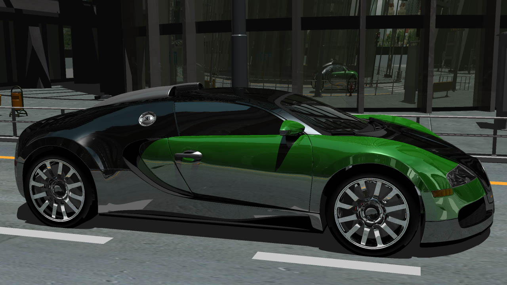
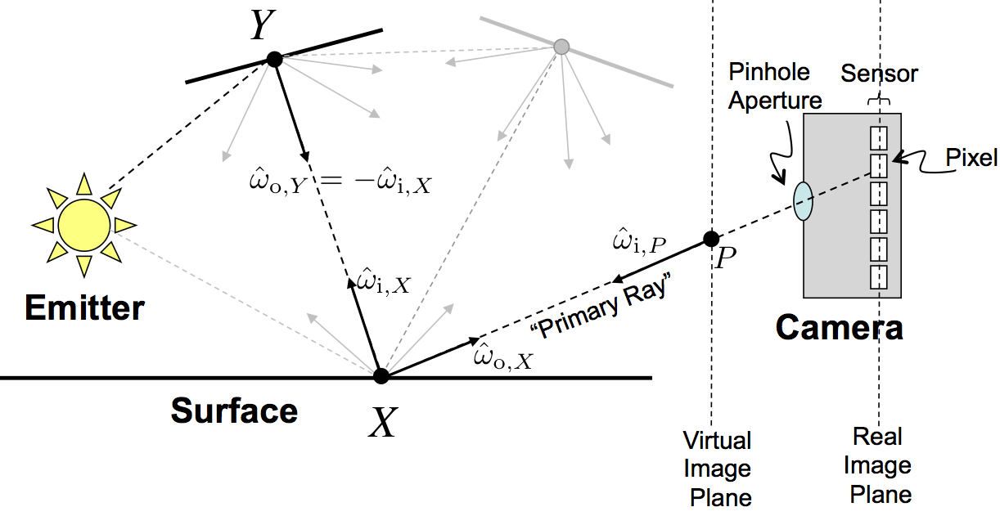

# Intro

Realistic rendering simulates light using models from physics and computer science to create images.

## Images and Light

Energy emitted as light travels through space as a streams of particles(called a Photon) until is hits a surface. Then, the energy is either scattered or absored. 
The scattered energy travels through space until it hits another surface. Where it is again either scattered or absorbed. Again, and again, and again...

That scattered light eventually makes its way into our eyes. Where again, some light is absorbed and scattered. Our brain forms images based on the trillions of light particles that reach our eyes.

The same journey takes place when capturing an image using a camera.

## Physics-Based Rendering

The goal of rendering is to compute the energy transfered to each pixel on an image sensor in the virtual world.

Computing or processing trillions of particles in a simulation requires hardware that does not exist in today's world. So, for efficiency, we have created a model where we combine actions of many photons at the same time.

We create an equation, that given some light sources, considers the energy that arrives at a camera sensor. It accounts for direction of the light, the area of the light, the size of the pixel, etc. This equation is called the `Rendering Equation`.
Through this model, we don't have to consider the trillions of particles of light in a given scene.

## The Rendering Equation

Consider a simple scene, as shown in the above diagram. A single light source, two surfaces, a virtual image plane, and camera.

When light emitted from the light source hits either surface, some light is scattered or absorbed. There are many paths for light to make its way into the camera. Some light is scattered across multiple surfaces, some light is emitted directly into the camera, etc.

Consider one of the possible paths, where a light ray is bounced from surface Y onto surface X and then into the camera.
Where that light ray is measured by the camera sensor. 

The measured light ray from the last surface along a path is called the `Primary Ray`.

This is the Rendering Equation. All complicated paths towards cameras/eyes eventually become a Primary Ray and we are trying to solve that equation as efficiently as possible.

## Surface Geometry

## Resources

https://graphicscodex.com/app/app.html?page=_rn_preface