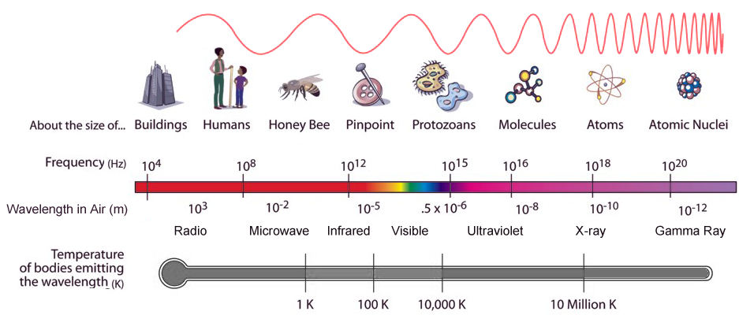
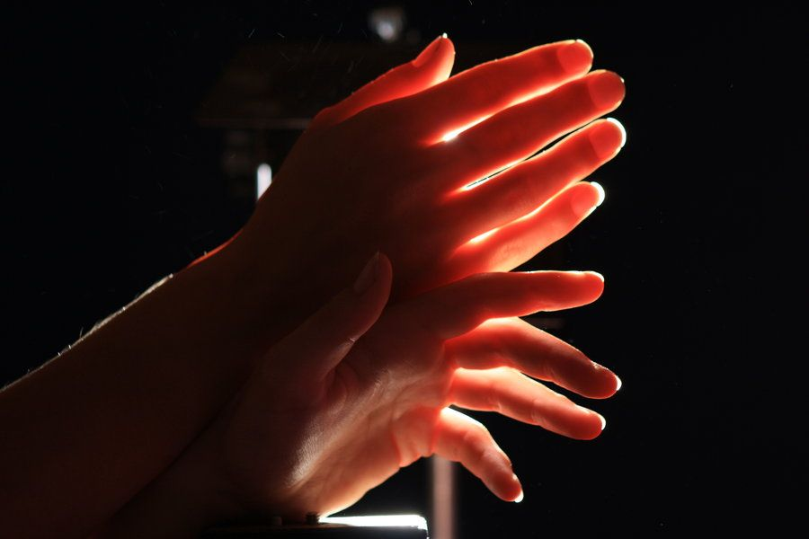
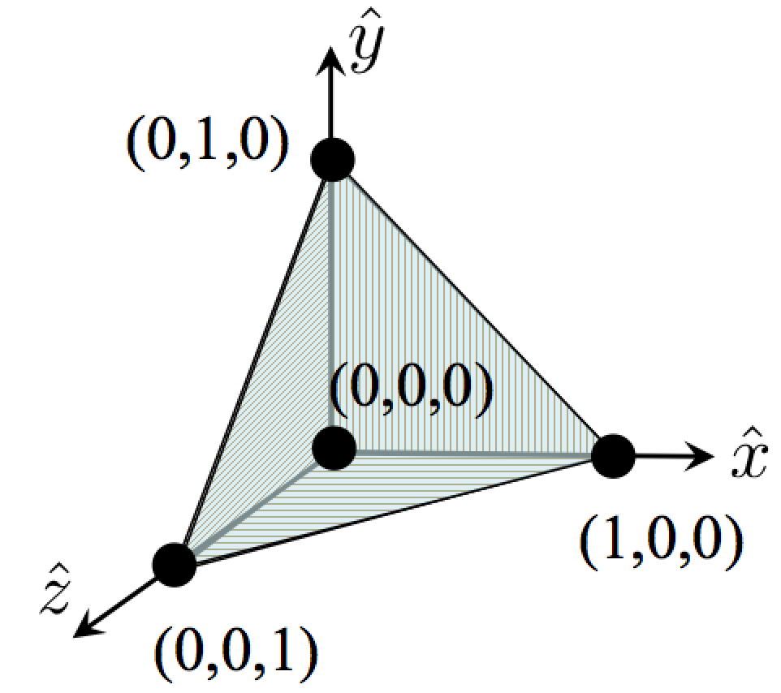
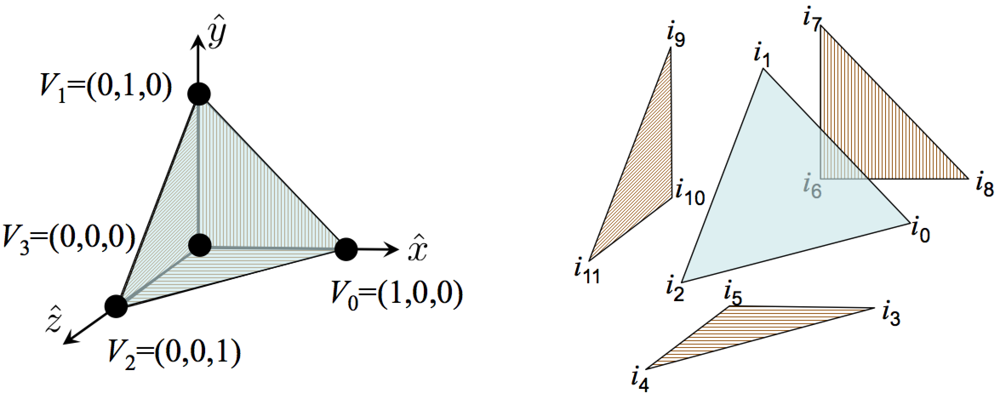

# Preface

Building this knowledge base, b/c I believe that the having a strong understanding of fundamentals will get me a long way.

Let's see how this goes.

## Resources

https://graphicscodex.com/app/app.html?page=_rn_preface
https://en.wikipedia.org/wiki/Physically_based_rendering
https://en.wikipedia.org/wiki/Rendering_equation
https://learnopengl.com/Introduction

https://en.wikipedia.org/wiki/List_of_common_3D_test_models
https://en.wikipedia.org/wiki/Utah_teapot#
https://en.wikipedia.org/wiki/Level_of_detail_(computer_graphics)

# Intro
Realistic rendering simulates light using models from physics and computer science to create images.

## Images and Light
Energy emitted as `Light`, travels through space as a streams of particles, until is hits a surface. Once the Light Energy hit a surface, it is either scattered or absored. 
Again, the scattered Light Energy travels through space, until it hits another surface. Where it is again, either scattered or absorbed. Again, and again, and again.

That scattered Light Energy, eventually makes its way into our eyes. Where again, some Light Energy is absorbed and some of it scattered. Our brain is able to form `Images` from the trillions of `Light Particles` that reach our eyes.

The same journey takes place when capturing an image using a camera.

## Physics-Based Rendering
The goal of Physics-Based Rendering is to create highly realistic images by accurately simulating the physical properties of materials and the interactions of light with those materials.

Computing or processing trillions of particles in a simulation, requires hardware that does not exist in today's world. So, for efficiency, we have created a model where we combine actions of many photons at the same time.

We create an equation, that given some light sources, considers the energy that arrives at a camera sensor. It accounts for direction of the light, the area of the light, the size of the pixel, transmissiveness, amongst other things. This equation is called the `Rendering Equation`.
Through this model, we don't have to consider the trillions of particles of light in a given scene.

## The Rendering Equation
The Rendering Equation is a fundamental concept that describes the transfer of light in a scene.

Consider a simple scene, as shown in the above diagram. A single light source, two surfaces, a virtual image plane, and a camera.

When light is emitted from the light source, there are many paths for light to make its way into the camera. Some light is scattered across multiple surfaces. Some light is emitted directly into the camera.

Consider one of the possible paths, where a light ray is bounced from surface Y, onto surface X, and then into the camera.
Where that light ray is measured by the camera sensor. 

The measured light ray from the last surface along a path is called the `Primary Ray`. The Primary Ray maps a single pixel on the screen to a point in the 3D scene.

This is the Rendering Equation. All complicated paths towards the eyes, eventually become a Primary Ray. We are trying to solve that equation as fast as we can.

## Light Radiation
Light is `Electromagnetic Radiation`. Light can propagate along a ray through a medium. For example, we can see through glass, air, and water because light propagrates through them.

Objects that are `Transparent`, allow Light Radiation to propagte through them. In physics and computer graphics, we use as a functional paramater, called `Transmittance`, to model and simulate transparency and translucency of an object.

Visible Light is just one small part of the Electromagnetic Spectrum. For example, we are not able to see through our skin and muscle tissues, because Visible Light Radiation is unable to propagate through them.
However, we can see through our skin and muscle tissues using `X-ray Radiation`. The frequency of X-ray Radiation allows it to propagate through our skin. We can then convert the X-ray Radiation into Visible Light Radiation.

Not all objects are uniform in their Transparency or Translucency. For example, there are some areas of our skin, tissue that some light is able to propagate through, interact underneath the surface of our skin, before exiting. Like your ears, nose, parts of your hand, etc. This is called `subsurface scattering`.

> **Note:** The speed of light will change depending on the medium it propagrates through. For example, the speed of light is 1.3 times slower in water and 2.5 times slower when propagating through a diamond.

## Surface Geometry
We can model an `object` as a collection of surfaces in computer grpahics. We are not concerned about any of the innards, mass, or anything else about the object. Our only concern is what is visible.

We can represent a surface through the following models:

1. `Geometry`, which models the space occupied by a surface.
2. `Materials`, which models its interactions with light.

### What is a surface?
A `Surface` is a 2D boundary between adjascent volumes of two different, homogenous media. A Surface is a generalization of the mathematical plane, where they differ, is that a Surface can be curved.

In this model a Surface is `single-sided`. In that way a surface will have a direction that it faces. Again, identical to the mathematical plane, where the normal to the plane defines the direction its facing.

### Triangle Meshes
In 3-Dimensions, a `Triangle` is the simplest polygon (known as `simplex`). Triangles serve as the building blocks for surfaces, as any higher-order polygon can be broken down into triangles.

A single Triangle consists of 3 points. A Surface can be built using of a set of Triangles, also known as a `mesh`.

The following is a Tetrahedron, consisiting of 3 Triangles:

Remember, a Surface is single-sided. By convention, the `front` of a triangle is defined as the side from which its `Vertices` are seen be ordered `counter-clockwise` (the right-hand rule).

We use `Mesh Indecies` to maintain the order of Vertices of the triangles of mesh.

