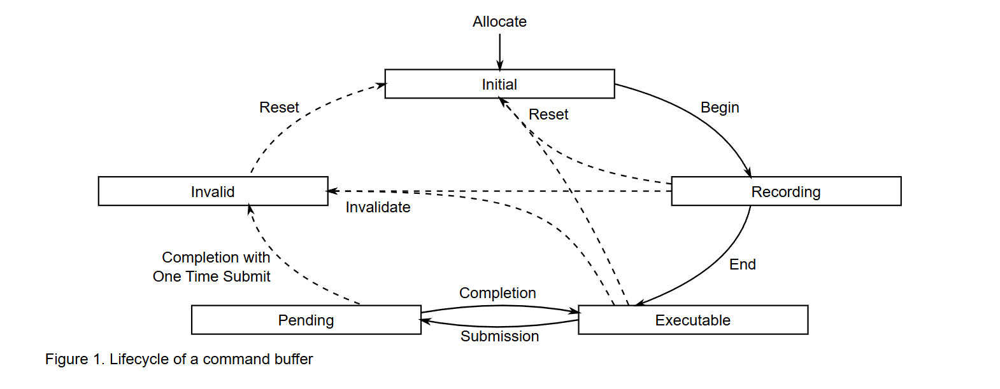

# Goals
I will never write this renderer from scratch again, I want to make it simple to use! I never want to go through this again! 

...
...
...

To my future self, your welcome!

# Resources
https://registry.khronos.org/vulkan/specs/1.3/html/
https://vulkan-tutorial.com/
https://vkguide.dev/

# Obseravations

- Device, Instance, Physical Device are good starting points for the renderer
- Commands, Queues, and Creating Command Buffers will be most likely the next step
- Will continue reading the specification as go

## Instance
The Vulkan `Instance`, simply put, when a `VkInstance` is created, the Vulkan library is initialized.

The `Instance` is responsible for the following:
- Enabling layers
- Enabling extensions
- Finding Physical Devices (GPUs)
- Setting up debug callbacks

### Layers
- When `Layers` are enabled, they are inserted into the call chain for Vulkan commands. They are useful for things like logging, tracing, validation etc.

### Extensions
- When `Extensions` are enabled, they provide new Vulkan commands, structures, and enumerants. Extensions are part of layers.

> **Note:** Instance extensions and Device extensions are supported independent of one another.

## Devices

Vulkan has two concepts of devices. A `PhysicalDevice` and a `LogicalDevice`. 

The `PhysicalDevice` represents a single complete implementation of Vulkan or in other words represents a GPU. A `LogicalDevice` represents an instance of that implementaion with its own state and resources.

### Physical Devices
Looked up by an Instance, a Physical Device can be selected based on its avaialble properties, version, etc. Its up to the developer to select their desired Physical Device.

Each Physical Device will have properties on its avaialble `Queues` and their `QueueFamilies`.

### Logical Device
Once a Physical Device has been selected, a Logical Device can then be created. That corresponding Logical Device can now be used as the interface of the PhysicalDevice.

When a Logical Device is created, all of the GPU's queues are created as well. This is where you have an opportunity to define the `Queue Priorities`, based on the needs of the application and what is avaialble on the GPU.

> **Note:** Queues with the same priority do not guarantee order, they may come in any order

> **Note:** Queues are created and destroyed along with the Logical Device. (Their lifetime are coupled)

A single Logical Device can be created from a group of Physical Devices. Groups of Physical Devices using a single Logical Device must support identical extensions, features, and properties.

### Queues
`CommandBuffers` are submitted to Queues to be executed on the GPU. Every GPU has multiple queues available. You can use multiple queues at the same time (in parallel).

All Queues come from a `QueueFamily`. A Queue Family defines the type of Queue and what commands that Queue supports. (Examples of Queue Families include: Graphics, Compute, Transfer, etc.)

> **Note:** When creating Command Pool, it is created for a specific Queue Family. All Command Buffers created from the corresponding Command Pool can only be used for that Queue Family.

## Commands

### Command Buffers
Command Buffers are objects that can record commands and send them to a Queue to be executed.

Recorded commands include commands to bind pipelines and descriptor sets to the command buffer, commands to modify dynamic state, commands to draw (for graphics rendering), commands to dispatch (for compute), commands to execute secondary command buffers (for primary command buffers only), commands to copy buffers and images, and other commands.

There are two levels for Command Buffers. There are `Primary` Command Buffers, which can execute Secondary Command Buffers, and can be submitted to Queues. There are `Secondary` Command Buffers, which can be executed by Primary Command Buffers, which are not directly submitted to Queues.

Each Command Buffer can be in one of the following states:
- `Initial`, when a Command Buffer is allocated, it is in the initial state.
- `Recording`, in this state Commands can be recorded to the Command Buffer
- `Executable`, the recording state has ended, now the Command Buffer can be submitted to a queue, recorded to another command buffer, or reset to its initial state
- `Pending`, when submitted to a queue, the buffer will enter the pending state. During which, Command Buffers must not be modified, since the device could be processing the commands recorded to it. After completion a command buffer can revert back to its Executbale or Invalid state.
- `Invalid`, when modifying or deleting a resource recorded by a command buffer, will transition the command buffer to the invalid state. Command Buffers in this state can only freed or reset.

The Lifecycle of a Command Buffer:

> **Note:** If a secondary command buffer moves to initial or invalid state, then all primary command buffers that is recorded in will move to the invalid state. A primary command buffer changing to any other state does not affect the secondary command buffers recorded on it.

### Command Pools
Command Pools are opaque objects that Command Buffers' memory is allocated from. This is done to reduce the cost over time for the resource creation of Command Buffers.

## Framebuffer
A `Framebuffer` organizes the memory resources needed to render an image. Essentially functioning as a queue of images that are waiting to be presented to the screen.

It holds the color data for each pixel that will be displayed on screen. Its often implemented as an area of memory in RAM or VRAM. 

> **Note:** `V-Sync` is accomplished with a Framebuffer, presenting the images with the `Refresh Rate` of the screen.

### Swap Chain
In Vulkan, a `Swap Chain` is the implementation of a Framebuffer. (Array of presentable images that are associated with a Surface).

> **Note:** A `Surface` is an abstraction of a Window/Device that is being displayed to.

https://registry.khronos.org/vulkan/specs/1.3-extensions/man/html/VkSwapchainKHR.html

### Images
An image is an array of data (Up to 3 arrays of data). Which can be used for various things. (i.e. SwapChain images, RenderTargets, Textures, etc.)

# Next Up
- Swap Chains
- Query Swap Chain Support/ Properties
- Configure Swap Chain presentation based on what is available
- Synchronization & Cache Control