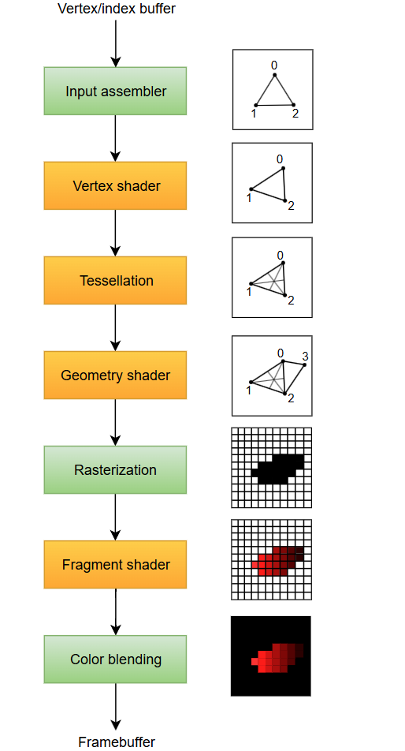
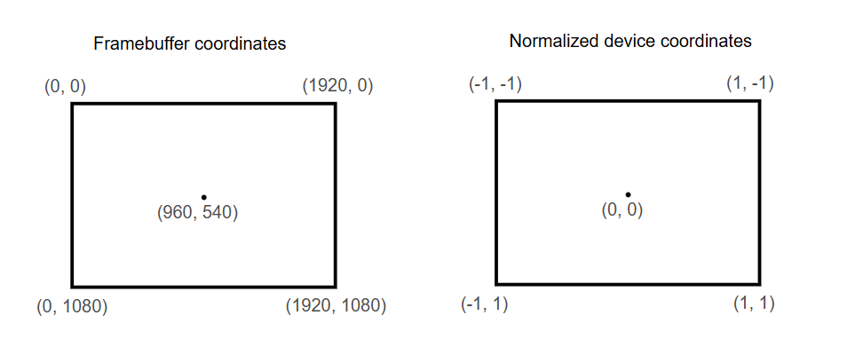
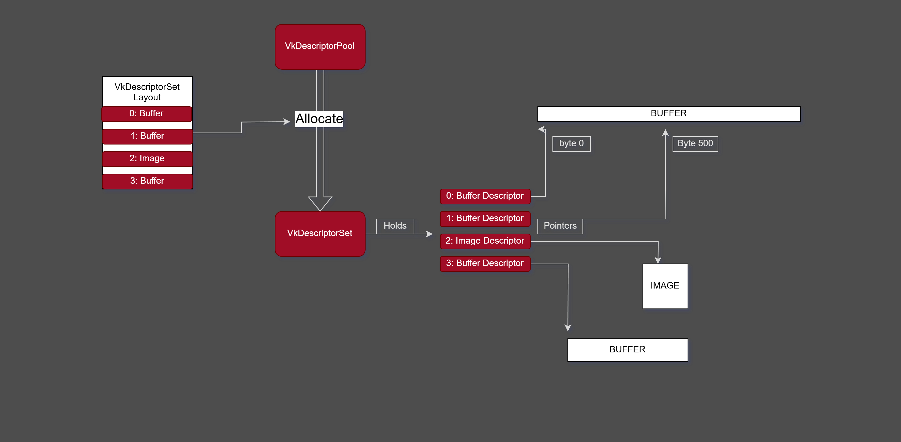

# Goal
This document will serve as a general outline for how Vulkan works. Providing my interpretation of the API and its various uses. Mixed in with high-level graphics concepts, where applicable.

I've tried my best to keep things as simple and straight-forward as possible. (There are still a lot of concepts that overlap.)

I've used the Vulkan Specs as the primary resource for all the below information. All resources can be found below:

# Vulkan
## Instance
The Vulkan `Instance`, simply put, when a `VkInstance` is created, the Vulkan library is initialized.

The `Instance` is responsible for the following:
- Enabling layers
- Enabling extensions
- Finding Physical Devices (GPUs)
- Setting up debug callbacks

### Layers
- When `Layers` are enabled, they are inserted into the call chain for Vulkan commands. They are useful for things like logging, tracing, validation etc.

### Extensions
- When `Extensions` are enabled, they provide new Vulkan commands, structures, and enumerants. Extensions are part of layers.

> **Note:** Instance extensions and Device extensions are supported independent of one another.

## Devices

Vulkan has two concepts of devices. A `PhysicalDevice` and a `LogicalDevice`. 

The `PhysicalDevice` represents a single complete implementation of Vulkan or in other words represents a GPU. A `LogicalDevice` represents an instance of that implementaion with its own state and resources.

### Physical Devices
Looked up by an Instance, a Physical Device can be selected based on its avaialble properties, version, etc. Its up to the developer to select their desired Physical Device.

Each Physical Device will have properties on its avaialble `Queues` and their `QueueFamilies`.

### Logical Device
Once a Physical Device has been selected, a Logical Device can then be created. That corresponding Logical Device can now be used as the interface of the PhysicalDevice.

When a Logical Device is created, all of the GPU's queues are created as well. This is where you have an opportunity to define the `Queue Priorities`, based on the needs of the application and what is avaialble on the GPU.

> **Note:** Queues with the same priority do not guarantee order, they may come in any order

> **Note:** Queues are created and destroyed along with the Logical Device. (Their lifetime are coupled)

A single Logical Device can be created from a group of Physical Devices. Groups of Physical Devices using a single Logical Device must support identical extensions, features, and properties.

### Queues
`CommandBuffers` are submitted to Queues to be executed on the GPU. Every GPU has multiple queues available. You can use multiple queues at the same time (in parallel).

All Queues come from a `QueueFamily`. A Queue Family defines the type of Queue and what commands that Queue supports. (Examples of Queue Families include: Graphics, Compute, Transfer, etc.)

> **Note:** When creating Command Pool, it is created for a specific Queue Family. All Command Buffers created from the corresponding Command Pool can only be used for that Queue Family.

## Commands

### Command Buffers
Command Buffers are objects that can record commands and send them to a Queue to be executed.

Recorded commands include commands to bind pipelines and descriptor sets to the command buffer, commands to modify dynamic state, commands to draw (for graphics rendering), commands to dispatch (for compute), commands to execute secondary command buffers (for primary command buffers only), commands to copy buffers and images, and other commands.

There are two levels for Command Buffers. There are `Primary` Command Buffers, which can execute Secondary Command Buffers, and can be submitted to Queues. There are `Secondary` Command Buffers, which can be executed by Primary Command Buffers, which are not directly submitted to Queues.

Each Command Buffer can be in one of the following states:
- `Initial`, when a Command Buffer is allocated, it is in the initial state.
- `Recording`, in this state Commands can be recorded to the Command Buffer
- `Executable`, the recording state has ended, now the Command Buffer can be submitted to a queue, recorded to another command buffer, or reset to its initial state
- `Pending`, when submitted to a queue, the buffer will enter the pending state. During which, Command Buffers must not be modified, since the device could be processing the commands recorded to it. After completion a command buffer can revert back to its Executbale or Invalid state.
- `Invalid`, when modifying or deleting a resource recorded by a command buffer, will transition the command buffer to the invalid state. Command Buffers in this state can only freed or reset.

The Lifecycle of a Command Buffer:

> **Note:** If a secondary command buffer moves to initial or invalid state, then all primary command buffers that is recorded in will move to the invalid state. A primary command buffer changing to any other state does not affect the secondary command buffers recorded on it.

### Command Pools
Command Pools are opaque objects that Command Buffers' memory is allocated from. This is done to reduce the cost over time for the resource creation of Command Buffers.

## Framebuffer
A `Framebuffer` organizes the memory resources needed to render an image. Essentially functioning as a queue of images that are waiting to be presented to the screen.

It holds the color data for each pixel that will be displayed on screen. Its often implemented as an area of memory in RAM or VRAM. 

> **Note:** `V-Sync` is accomplished with a Framebuffer, presenting the images with the `Refresh Rate` of the screen.

### Swap Chain
In Vulkan, a `Swap Chain` is the implementation of a Framebuffer. (Array of presentable `Images` that are associated with a Surface).

> **Note:** A `Surface` is an abstraction of a Window/Device that is being displayed to.

https://registry.khronos.org/vulkan/specs/1.3-extensions/man/html/VkSwapchainKHR.html

## Resource Creation
Vulkan supports two primary resource types: `Buffers` and `Images`. Resources are views of memory with formatting and dimensionality.

Buffers provide access to raw arrays of bytes. Images can be multi-deminsional and may have metadata. 

### Buffers
Buffers represent linear array data. Buffers can be used for various things, by binding them to a Graphics or Compute Pipeline. (Binding is done via DescriptorSets or through Commands)

### Buffer Views
Buffer Views are used to represent the contigous memory of a Buffer, along with its formatting, that will outline how it should be read/interperated.

### Images
An Image is an array of data (Up to 3 arrays of data). Which can be used for various things. (i.e. SwapChain images, RenderTargets, Textures, etc.)

> **Note:** While Images contain data, there are not directly used by the Pipeline Shaders. `Image Views` are used to represent Images and their subresources, containg additional metadata for the Pipeline.

### Image Views
An Image View represents an Image with all its subresources. An Image View contains additional metadata used by Pipeline Shaders. When created, an Image Views must be comptable with the Image that it will be representing.

## Pipelines
In computer graphics, the `Graphics Pipeline` is a sequence of operations that convert textures, vertices, and meshes into pixels on a render target.

### Graphics Pipeline
The Graphics Pipeline is made up of `Programmable` and `Fixed-Function` stages. 

In Programmable stages, code can be uploaded (For example: different types of Shaders). Where as, in Fixed-Function stages, parameters are passed to pre-defined functionality.

The Graphics Pipeline is split into the following stages:

> **Note:** In the the above image: `Green` stages are Fixed-Function stages. `Orange` stages are Programmable stages.

1. `Input Assembler`, collects data from specified vertex and index buffers.
1. `Vertex Shader`, runs for every vertex and passes per-vertex data down the pipeline.
1. `Tessellation Shader`, can subdivide geometry based on rules to increase mesh quality.
1. `Geometry Shader`, runs on every primitive and can discard it or add more primitives.
1. `Rasterization`, transforms primitives into fragments and any fragments outside of the screen or behind other fragments are discarded.
1. `Fragement Shader`, runs for all surviving fragments and interpolates passed vertex-data to determine depth and color values.
1. `Color Blending`, mixes different fragments that map to the same pixel in the same frame considering things like transparency. Which is then passed to the framebuffer.

### Vertex/Index Buffer
Used to define how vertices will be laid out and read from in memory. It also defines Attributes the attributes passed to the Vertex Shader. 

### Input Assembler
Defines the type of primitives that will be drawn. This is specified through `Topology`, for example, Triangles, Lines, Points, etc.

### Shaders
Shaders are executable operations that execute at the various stages of the Graphics and Compute Pipelines.

Shaders can read from input variables. Read from and write to output variables. Input and output variables can be used to transfer data between shader stages in a pipeline.

### Vertex Shader
The Vertex Shader processes each incoming vertex and its data (position, normal, texture coordinates, color, etc.). The output from this process is a Vec4 Clip Coordinate. 
This Clip Coordinate is turned into a `Normalized Device Coordinate`. Finally the Normalized Device Coordinate is mapped the the Framebuffer, as shown in the image below.

### Viewports & Scisors
In Vulkan, when working with Graphics Pipeline some information is required to be defined at creation. While some information can be used in a dynamic state. This includes things like viewport and scissor sizing.
Allowing us to change the size of the viewport without recreating the Graphics Pipeline.

While viewports define the transformation from the image to the framebuffer, scissor rectangles define in which regions pixels will actually be stored. Any pixels outside the scissor rectangles will be discarded by the rasterizer.

### Rasterizer
Takes the geometry of shape, provided by its vertices in the Vertex Shader and turns it into Fragments, to be colored by the Fragment Shader.
The Rasterizer performs `Depth Testing`(Z-Buffering) and `Face Culling`(Back-Face Culling) and the Scissor Test.

### Multisampling Anti-aliasing
Anti-aliasing is achieved by merging the results of the Fragment Shader, where multiple polygons rasterize to the same pixel.

### Compute Pipleine
The Compute Pipeline is used to read and write memory from Images and Buffers

## Renderpass
In Vulkan a Renderpass describes how many Color and Depth bufffers, how many Samples there will be for each of them and how all of its contents should be handled during the rendering operations.

> **Note:** `Sample` can be described as single data point in Multisampling. Which is used in Anti-aliasing. The higher the Sample count, the higher the memory and perfomance cost.(i.e. 1 sample per pixel (not Multisampling), 4 samples per pixel, 6, 8, etc.)

Describing the Color or Depth buffers are done through Attachments. Where the Sameple count is passed a parameter. Along with that, Attachments also describe how data is loaded and stored before and after rendering.

> **Note:** `Stencil Buffer` is an extra Data Buffer used in computer graphics in addition to the Color and Depth Buffers. This buffer is per-pixel and works on integer values. 
The combination of stencil and depth buffer make a lot of things possible. Such as such as stencil shadow volumes, Two-Sided Stencil, compositing, decaling, dissolves, fades, swipes, silhouettes, outline drawing, or highlighting of intersections between complex primitives.

The Renderpass is can be made up of multiple `Subpasses`. Where Subpasses, are rendering operations that dependent on the content of the previous data in the Framebuffer. 
Grouping the rendering operations into one Renderpass can allow Vulkan to optomize the performance of the operations.

## The Different Graphics Pipelines
In rendering applications its common to have multiple pipelines. It provides an opportunity to optimize performance per-pipeline, allows for different `Render Passes` and different rendering configurations.

For example, you could create a different pipeline for the 2D interface in your application and another pipeline for 3D objects in your world. 
You can create a seperate pipeline for dynamic and static objects, where static objects use simpler shaders and dynamic more complex.
You can create pipelines for special effects, like shadows, particles and Screen-Space Reflections.

The following is a list of common use-cases for Graphics Pipelines:
1. `Forward Rendering` Pipeline
	-  Used for straightforward rendering where all shading and lighting calculations are done in a single pass. 
	- Common in applications with limited dynamic lights or simpler scenes.
1. `Deferred Rendering` Pipeline
	-  Separates geometry and lighting into multiple passes, first writing geometry information to a G-buffer, then applying lighting in a subsequent pass.
	- Efficient for scenes with many dynamic lights.
1. `Shadow Mapping` Pipeline
	-  Used for rendering shadows in a scene. 
	- Involves rendering the scene from the light's perspective to create a depth map (shadow map).
1. `Post-Processing` Pipeline
	-  Applied after the main rendering to add effects such as bloom, motion blur, tone mapping, and depth of field.
1. Particle System Pipeline
	-  Specialized for rendering particles, such as smoke, fire, and explosions. 
	- Often uses instancing and other optimizations to handle large numbers of particles.
1. `SkyBox` Pipeline
	-  Used for rendering the background environment, like a skybox or skydome. 
	- Typically involves rendering a textured box or dome around the scene (`Cubemap`).
1. `Ambient Occlusion` Pipeline
	-  Adds ambient occlusion effects to simulate soft shadows in creases and corners. 
	- Techniques like SSAO (Screen-Space Ambient Occlusion) are common.
1. `Instanced Rendering` Pipeline
	-  Optimizes the rendering of multiple instances of the same geometry. 
	- Common in scenes with many repeated objects, like forests or crowds.
1. Water Rendering Pipeline
	-  Used for rendering realistic water surfaces. 
	- Typically involves reflections, refractions, and wave simulations.
1. Wireframe Rendering Pipeline
	-  Renders objects in wireframe mode. 
	- Useful for debugging and visualizing geometric structures.
1. `Volumetric Lighting` Pipeline
	-  Simulates light scattering through a medium, like fog or smoke. 
	- Adds realism to scenes with volumetric effects.
1. Compute Shader Pipeline
	-  Uses compute shaders for tasks like physics simulations, particle updates, or complex lighting calculations. 
	- Separate from traditional graphics pipelines but often integrated into the rendering process.
1. `Ray-tracing` Pipeline
	-  Uses ray tracing techniques for realistic lighting, shadows, and reflections. 
	- More computationally intensive but provides higher visual fidelity.

## Synchronization
Explicitly defining the expected order of operation on the GPU and CPU. We are able to define and wait for execution order using `Fences`, for the CPU and `Semaphores`, for the GPU.

### Fences
Fences can be used to determine when some operation has completed execution on the GPU and controlling access to resources on the GPU and CPU.

To control operation order, a Fence, inserts dependencies from a Queue to the GPU. Fences have two states - Signaled or Unsignaled.

> **Note:** Data can be accessed by a Fence, the data associated with the signaled and unsignaled operation on that fence object, is called the `Fence Payload`. 
This allows sharing of resources between other Sempahore objects and other synchronization primitives, functioning similar to a mutex.

### Semaphores
Semaphores can control the operation order of work submitted to different Queues and controlling access to resources on the GPU.

To control operation order, a Semaphore, inserts dependancies between Queue operations or between Queue operations and the GPU.

> **Note:** There are two types of Semaphore. `Binary Semaphore` - has two states either Signaled or Unsignaled. `Timeline Semaphore` - has 64-bit unsigned integer with a strictly increasing value, and are signaled with respect to a specified reference value.

> **Note:** Data can be accessed by a Semaphore, the data that is associated with the unsignaled or signaled operations performed on that semaphore object, refered to as a `Semaphore Payload`.
This allows sharing of resources between other Semaphore objects and other synchronization primitives, functioning similar to a mutex.

## Uniform Buffers
`Uniform Buffers` are globally defined variable shared across shaders. It allows us to define a variable across multiple shaders and efficiently update the variable without having to write to vertex data at run-time.

## Descriptors
A descriptor is structure that represents a shader resource. (Buffer, Image, Sampler, etc.) Descriptors are organized into `Descriptor Sets`.

## Constants
Constants can be used pushed to data to shader at any given stage. To pass in constant to be used within the shader.

# Resources
## Vulkan Sources:
- https://registry.khronos.org/vulkan/specs/1.3/html/
- https://vulkan-tutorial.com/
- https://vkguide.dev/

## Other Sources:
- https://en.wikipedia.org/wiki/Z-buffering
- https://en.wikipedia.org/wiki/Back-face_culling
- https://en.wikipedia.org/wiki/Multisample_anti-aliasing
